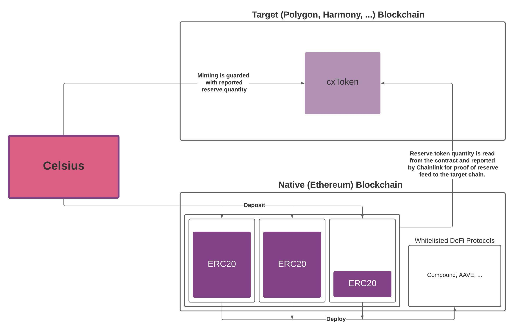
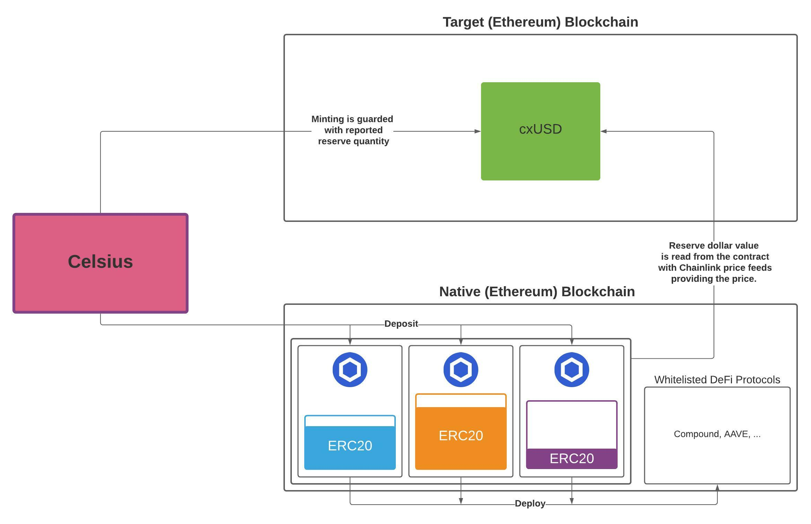

The Collateral Manager contract calculates the reserve quantity of ERC20 tokens and that quantities dollar denominated
values. It is dependant on `calculator` adapter contracts that are used for reporting these quantities which also
serve as an abstraction for the assets representing the collateral for the reserves. The reserves are meant to be read
by an oracle service like Chainlink for reporting proof of reserve, or by another contract native to the same chain
where the collateral is deployed.

# Collateral Manager

Manages sets of vaults. Each set is called a reserve and labeled with a unique `bytes32` identifier. Depending on the
adapter contracts used to define a vault the quantity reported back by the reserve will either be a token quantity
or dollar amount.

# Vault Calculator

Interface for the `calculator` adapter contracts provided with each `Vault`.

# Collateral V3 Aggregator

Oracle contract implementation compatible with the Chainlink Aggregator for when the collateral is on the same chain
as the Wrapped instance.

# Address Manager

Contract used to share addresses where reserves are held on different chains.





# Operations

The management of this contract requires some precautions by the operator in order to not confuse the way data is read. 
Specifically, making more than one call to `createReserve` if they end up in the same block will result in only one new
unique `reserveId`. This should not generally be a problem as expected values describing each reserve will most likely
be unique.

## Setup

```sh
npm ci
```

Because this contract relies on other contracts and platforms running on Ethereum you will want to fork a chain when
starting up Ganache, and run the test against that.

```sh
npx ganache-cli --fork https://kovan.infura.io/v3/${PROJECT_ID}
```
